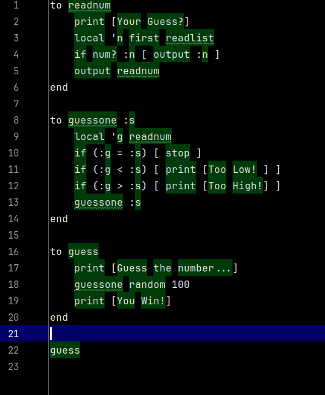

Language Server Protocol 
============================

This doc describes current state of Language Server Protocol server for MLogo.

Running it
-------------
Compile source code with Maven:
```
mvn clean package 
```
Output is a fat jar that bundles all dependencies:
```
target/logo-lsp-1.0.0-SNAPSHOT-jar-with-dependencies.jar 
```
Next step is to enable this Language Server in Idea, to handle `.logo` files.

Note: it says "server", but does not use networking for communication. It is process started by Idea, and uses pipes. 

1) In IntelliJ Idea Community Edition install plugin [LSP4IJ](https://plugins.jetbrains.com/plugin/23257-lsp4ij)
2) Goto Settings > Languages & Frameworks > Language Servers 
3) Click + to add new server
4) As title select "Logo", 
5) in command select `java  -jar <PATH_TO_JAR>>/logo-lsp-1.0.0-SNAPSHOT-jar-with-dependencies.jar`
    - there is optional command line argument, directory where LSP logs will be saved. That can help to debug com between server and Idea
6) Under tab *Mappings* add File name pattern for '*.logo' files

Now when you open `*.logo` file (some are in examples folder in this project), 
you should see editor with basic syntax highlight:



What works
---------------

Limited syntax highlight is available.  
Editor is aware of Logo words and can recognize them. 
Only single type of token (word) is supported, 
there is settings to handle multiple token types, but that is not implemented yet.

Goto definition for methods is supported. 
Put cursor on some method call, press *CTRL+B* and cursor will jump to definition of method.

Very limited code completion is supported. Type part of word, press *CTRL+Space*. 
But this code completion is not provided by this project, but by LSP4IJ project itself.

Limitations
---------------

This project does not support **incremental parsing** yet. 
On every change, entire file is reparsed. 
It should be simple to implement incremental parsing based on single lines.

Parsed **tokens are not cached**. After parsing for syntax highlight, tokens are discarded. 
Any action such as *Goto Declaration* will trigger full file reparse. 

Debug and run support
-----------------------

Main goal for this project was to see how 
[Debug Adapter Protocol](https://microsoft.github.io/debug-adapter-protocol//)
works. However it was too complex to finish on time. And there are not many examples. 

I will probably continue on Debug support latter. 

Architecture
--------------

This project uses [MLogo](https://github.com/JohnEarnest/MLogo) implementation. 
It provides parser and rutime for Logo language. 

I used MLogo because it came with some documentation, unit tests and can actually run MLogo code. 
I Mavenized this project and wrote some unit tests. 
I replaced static methods and modified calls to `System.exit()`, so it can now run as normal java library. 
I also made some changes in parser to provide line numbers for tokens. 

LSP integration uses [LSP4J](https://github.com/eclipse-lsp4j/lsp4j). It is wrapper over LSP RPC-JSON calls. 
Intellij Idea starts LSP server as new process and communicates over stdin/out pipes. 

Code to handle Syntax Highlight and Goto Definition is in `LogoTextDocumentService.java` file. 

Debugging
-----------

There are two ways to debug this code:

Using standard in-process java debugger. In this case modify LSP command line to open debug port, and attach remote debugger from Idea. 

I also found it useful to have JSON-RPC log files. It captures communication between Idea and LSP server. 
It makes it easy to see what part of protocol are not implemented yet. 
There is simple wrapper around Input/Output streams that captures LSP protocol, and dumps it into text log files. 

To enable remote debugging with protocol log files, use following command line in LSP4IJ command line:

```
java -agentlib:jdwp=transport=dt_socket,server=y,suspend=n,address=*:6006 -jar <PATH TO PROJECT>/target/logo-lsp-1.0.0-SNAPSHOT-jar-with-dependencies.jar <DIR WITH LOGS>
```

After every code change, you have to rebuild jar file, and restart LSP server from *Language Servers* window.